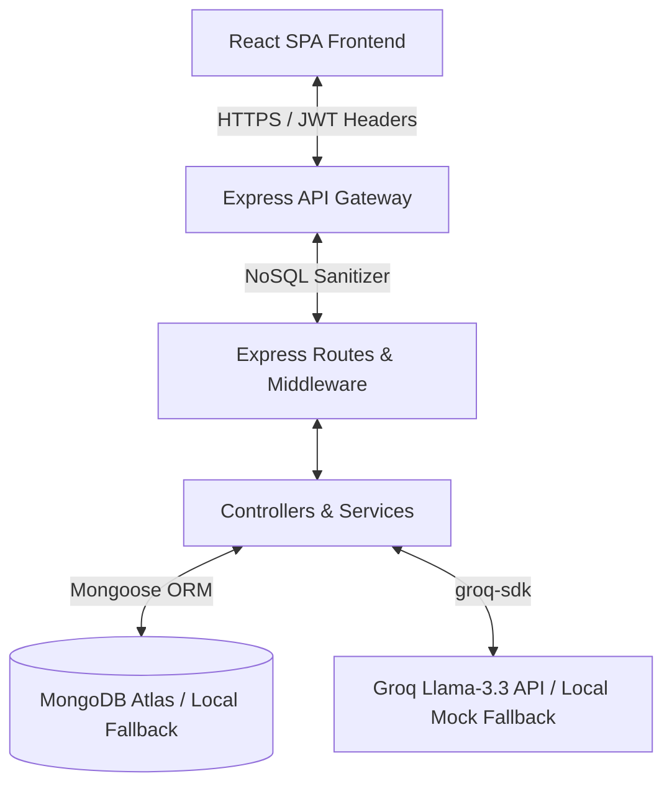
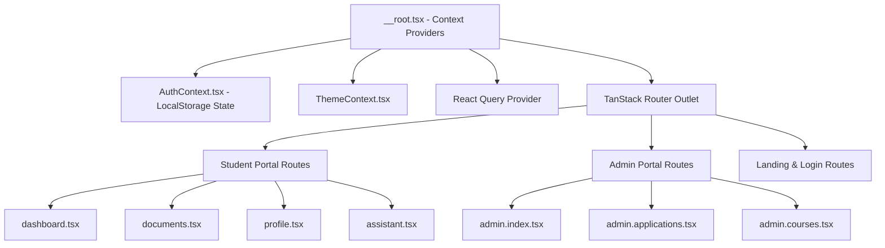
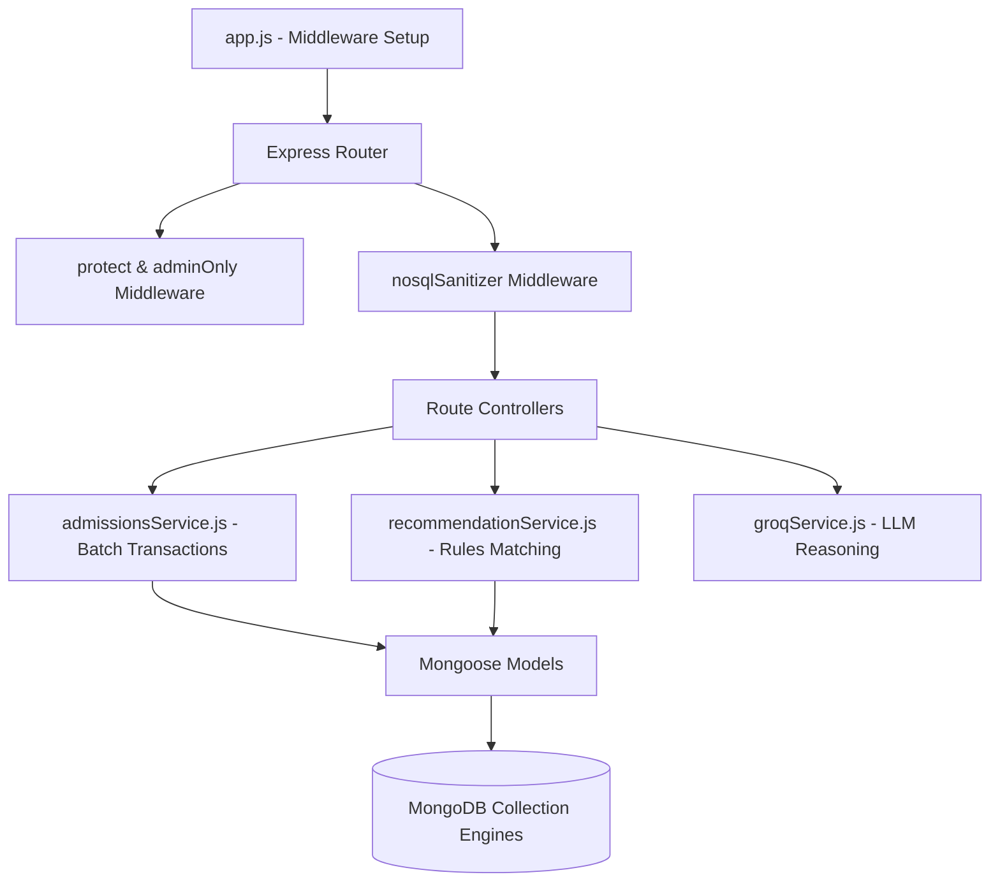
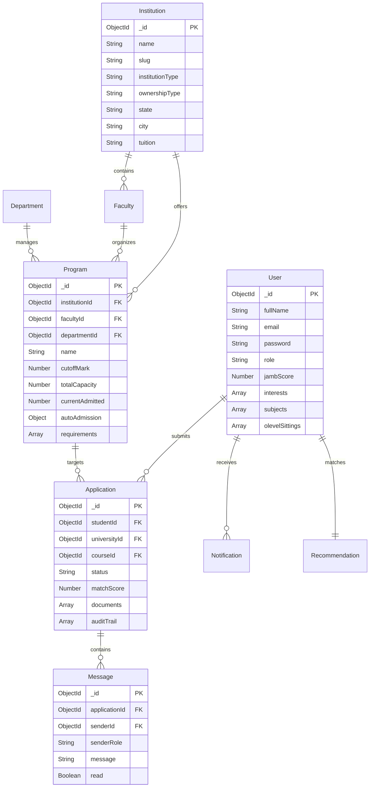
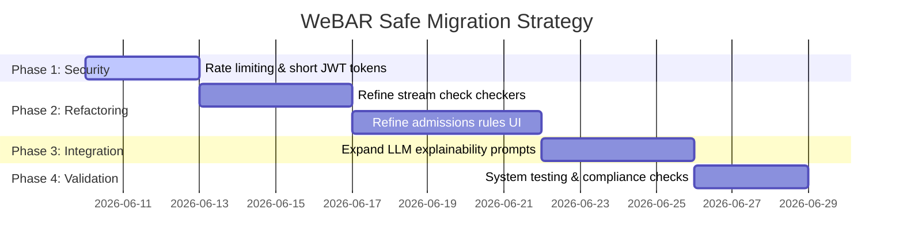

# WeBAR Enterprise System Reverse-Engineering & Gap Analysis Audit Report

This report presents a comprehensive technical audit, architectural mapping, security assessment, and gap analysis of the WeBAR platform.

---

## 1. Executive Summary

WeBAR is an enterprise university admission matching and career guidance application. The system is designed to streamline tertiary education matching for Nigerian universities, focusing on Lagos State University of Science and Technology (LASUSTECH) as the launch partner.

### Key Audited Highlights
- **Architecture Style:** Decoupled SPA (Single Page Application) frontend built with React, Vite, and TanStack Router; RESTful API backend built with Node.js, Express, and Mongoose (MongoDB).
- **Core Engine:** Hybrid rules-based and AI-based admissions matching. It extracts academic scores, evaluates prerequisite credit counts, and validates subject combinations. If rejected due to capacity, it uses a LLM (Llama-3.3 via Groq) to outline recourse options.
- **Security Posture:** Solid baseline with global NoSQL injection sanitizers, Helmet headers, CORS filters, and strict file validations (mime-type and signature checks). Vulnerabilities exist around token expiration lengths (30 days) and lack of rate limiters on high-computation endpoints.

---

## 2. System Architecture Diagram

---

## 3. Frontend Architecture Diagram

---

## 4. Backend Architecture Diagram

---

## 5. Entity Relationship Diagram (ERD)

---

## 6. API Inventory

| Route | Method | Purpose | Request Schema | Response Schema | Security / Role |
| :--- | :--- | :--- | :--- | :--- | :--- |
| `/api/auth/register` | POST | Register student | `{ fullName, email, password }` | `{ success, message, data: { user, token } }` | Public |
| `/api/auth/login` | POST | Authenticate user | `{ email, password }` | `{ success, message, data: { user, token } }` | Public |
| `/api/users/profile` | GET | Fetch profile data | None | `{ success, data: User }` | Student/Admin (JWT) |
| `/api/users/update-profile` | PUT | Update profile fields | `{ fullName, jambScore, interests, stateOfOrigin, lga, preferredCourse, subjects, olevelSittings }` | `{ success, data: User }` | Student/Admin (JWT) |
| `/api/users/dashboard-context`| GET | Consolidated context | None | `{ success, data: { profile, recommendations, notifications } }` | Student (JWT) |
| `/api/users/upload-document` | POST | Upload result files | Form-data: `file` | `{ success, data: Document }` | Student (JWT) |
| `/api/users/ocr-extract` | POST | Read result files via OCR | Form-data: `file` | `{ success, data: OCRResult }` | Student (JWT) |
| `/api/users/documents/:id` | DELETE | Delete locker document | None | `{ success, message }` | Student (JWT) |
| `/api/recommendations` | GET | Recommendations | None | `{ success, data: [Recommendation] }` | Student (JWT) |
| `/api/applications/apply` | POST | Submit application | `{ universityId, courseId, documents }` | `{ success, data: Application }` | Student (JWT) |
| `/api/applications` | GET | List student applications| None | `{ success, data: [Application] }` | Student (JWT) |
| `/api/applications/:id/messages`| GET | Get chat history | None | `{ success, data: [Message] }` | Student/Admin (JWT) |
| `/api/applications/:id/messages`| POST | Send support chat message| `{ message }` | `{ success, data: Message }` | Student/Admin (JWT) |
| `/api/applications/:id/confirm-accept`| POST | Accept admissions offer | None | `{ success, data: Application }` | Student (JWT) |
| `/api/admin/analytics` | GET | System totals & trends | None | `{ success, data: Analytics }` | Admin Only (JWT) |
| `/api/admin/applications` | GET | Retrieve all applications| None | `{ success, data: [Application] }` | Admin Only (JWT) |
| `/api/admin/applications/:id/status`| PUT | Evaluate application | `{ status, notes }` | `{ success, data: Application }` | Admin Only (JWT) |
| `/api/admin/programs/:id/run-admissions`| POST | Batch run admissions | None | `{ success, data: BatchResult }` | Admin Only (JWT) |
| `/api/ai/chat` | POST | Chat with counselor Ada | `{ messages }` | `{ success, data: Response }` | Student (JWT) |
| `/api/ai/career-guidance` | POST | Build career reports | `{ interest }` | `{ success, data: Guidance }` | Student (JWT) |

---

## 7. Security Audit Report

### [HIGH] Long-Lived JWT Tokens
- **Finding:** JWTs are issued with a `30d` (30 days) expiration period and stored in the client browser's `localStorage`.
- **Impact:** If an attacker exfiltrates the token via XSS, they gain persistent access to the student profile and documents for up to a month.
- **Remediation:** Reduce JWT lifespan to `1 hour` and implement a refresh token flow using HTTP-only cookies.

### [MEDIUM] Missing API Rate Limiting
- **Finding:** High-overhead routes like `/api/ai/chat`, `/api/ai/career-guidance`, and `/api/users/ocr-extract` do not have rate-limiting middleware configured.
- **Impact:** An attacker can trigger thousands of LLM completions or file uploads in parallel, exhausting api quotas and driving up billing costs.
- **Remediation:** Implement `express-rate-limit` globally and on specialized computation routes.

### [LOW] Verbose Mongoose Schema Cast Exceptions
- **Finding:** Cast errors on invalid ObjectId inputs return detailed database fields in response payloads.
- **Impact:** Exposes internal schema information to potential attackers.
- **Remediation:** Sanitize CastError messages in `app.js` to return a generic "Resource not found" text.

---

## 8. Feature Inventory

| Feature Name | Status | Frontend Components | Backend Routes / Controllers | Database Entities |
| :--- | :--- | :--- | :--- | :--- |
| **User Authentication** | Working | `login.tsx`, `register.tsx` | `/api/auth/register`, `/api/auth/login` | `User` |
| **Academic Locker (OCR)**| Working | `documents.tsx` | `/api/users/upload-document`, `/api/users/ocr-extract` | `User` (uploadedDocuments) |
| **Student Dashboard** | Working | `dashboard.tsx` | `/api/users/dashboard-context` | `User`, `Notification` |
| **Admission Matcher** | Working | `dashboard.tsx`, `recommendations.tsx` | `/api/recommendations`, `recommendationService.js` | `Program`, `Recommendation` |
| **Direct Apply Stepper** | Working | `dashboard.tsx` | `/api/applications/apply`, `applicationController.js` | `Application`, `Program` |
| **Admissions Support Chat**| Working | `admin.applications.tsx`, `applications.tsx` | `/api/applications/:id/messages` | `Message`, `Application` |
| **Batch Run Admissions** | Working | `admin.courses.tsx` | `/api/admin/programs/:id/run-admissions` | `Program`, `Application` |
| **AI Counselor Ada** | Working | `assistant.tsx` | `/api/ai/chat`, `groqService.js` | None |
| **Career Reports** | Working | `career.tsx` | `/api/ai/career-guidance` | `Notification` |

---

## 9. WeBAR Gap Analysis

| Requirement | Existing Implementation | Missing Implementation | Action Plan |
| :--- | :--- | :--- | :--- |
| **1. Applicant Registration** | Fully functional local student registration. | Role allocation for school admins. | Reuse, add schema roles. |
| **2. Admission Recommendation Engine** | Dynamic and cached pre-filtered recommendations. | Localized score scaling. | Reuse, refactor cache. |
| **3. Eligibility Checking** | Prerequisite and strict subject stream verification. | Local state verification rules. | Reuse, refactor checkers. |
| **4. Explainable Recommendations**| Dynamic reason fields retrieved from database. | High-resolution LLM feedback. | Reuse, refine explanations. |
| **5. Personalized Recourse** | Rejected applicants receive custom alternative suggestions. | Dynamic score deficiency metrics. | Reuse, refine prompts. |
| **6. Alternative Suggestions** | Faculty-level programs matched dynamically. | Cross-faculty proximity matching. | Reuse, refactor query. |
| **7. Career Guidance** | Custom AI advisor career report generation. | Historical cohort mapping. | Reuse, enhance interface. |
| **8. Slot Optimization** | Atomically managed program enrollment capacities. | Dynamic batch allocation. | Reuse, refine service. |
| **9. Admin Dashboard** | High-performance aggregate metrics and trends. | Real-time school logs. | Reuse, expand panels. |
| **10. Rule Management** | Database schema configurations for cutoffs. | Rules UI manager dashboard. | Refactor rules system. |
| **11. Audit Logging** | Embedded application transactional log history. | Global system auditor log files. | Expand logging layer. |

---

## 10. Safe Migration Roadmap

### Risk Mitigation Strategy
1. **Preserve Current Functionality:** Maintain backward compatibility for all Mongoose models. Changes to `userModel.js` and `validationMiddleware.js` should not introduce breaking changes to authentication or profile loading.
2. **Step-by-step Refactoring:** Verify each refactored service layer (e.g. stream checking) using automated tests before proceeding to frontend changes.
3. **Graceful Fallbacks:** Keep the local fallback advisor logic intact in `groqService.js` to ensure the application remains operational even if remote AI endpoints are unavailable.
