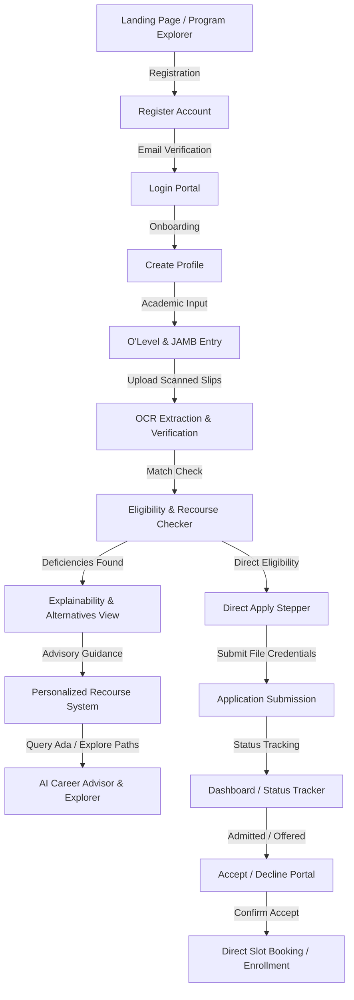
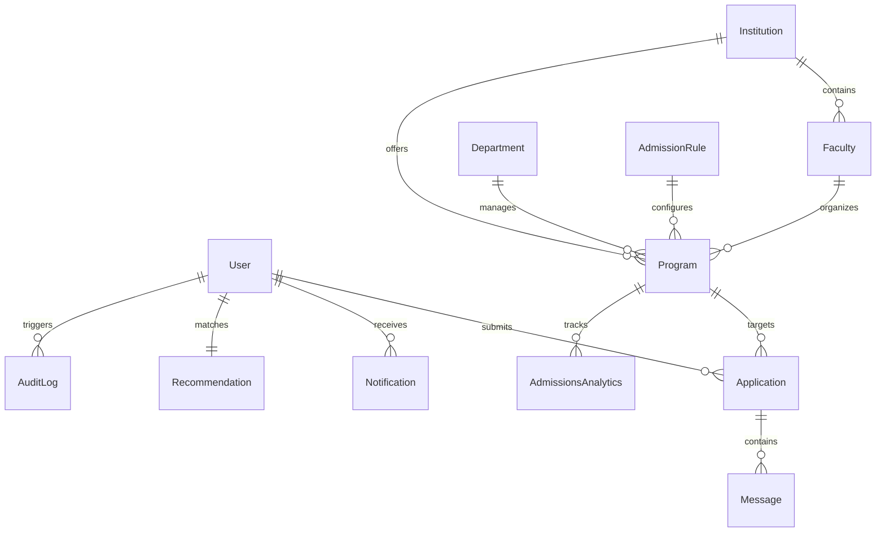

# WeBAR Enterprise UX, Product, Architecture & Feature Evolution Plan

This blueprint outlines the comprehensive redesign and architectural evolution of the Enhanced Web-Based Admission Recommender System (WeBAR). The goal is to evolve the current application into a production-ready, highly explainable, scalable, and optimized university admission platform while preserving all existing, audited functionalities.

---

## Deliverable 1: Complete User Journey

The redesigned WeBAR platform optimizes the applicant's end-to-end journey from initial discovery to final enrollment. Below is the step-by-step path:



### Detailed Journey Steps

1. **Discovery & Guidance (Public Pages):** 
   The applicant starts at the **WeBAR Landing Page**. They can search courses using the **Program Explorer** or review general guidelines on the **Admission Guide**. They can explore career paths matching their interests via the **Career Explorer** without authenticating.
2. **Onboarding & Authentication:** 
   The applicant registers using the **Register Page** (Full Name, Email, Password, and Role selection). After successful registration, a **Verify Email Page** checks credentials. The applicant then logs in via the **Login Page**, which stores a short-lived JWT securely and redirects them to the Portal.
3. **Academic Locker & Profile Construction:** 
   The applicant is guided to the **Academic Profile Setup**. They fill in State of Origin, LGA, and Preferred Course, and proceed to:
   - **O'Level Entry:** Input sittings (up to two sittings allowed for LASUSTECH) listing year, exam type (WAEC/NECO), exam number, subjects, and grades.
   - **JAMB Entry:** Input UTME registration number, total score, and the 4 specific subjects written and their individual scores.
   - **Document Upload & OCR:** Upload scanned copies of WAEC/NECO slips and JAMB result sheets. An OCR engine extracts grades and scores, cross-verifying them against the manual inputs to guarantee credibility.
4. **Admissions Eligibility & Recommendation Pipeline:**
   The recommender evaluates the applicant's profile:
   - If the applicant is eligible for their preferred course, the system highlights a **Direct Apply** button, bypassing general recommendations to prevent distraction.
   - If the applicant fails cutoff marks, has a subject stream mismatch (e.g., Commercial student applying for Engineering), or lacks core subjects, the **Eligibility Checker** flags these issues.
5. **Interactive Explainability & Recourse Advice:**
   The portal presents the **Recommendation Results** accompanied by the **Explainability View**, detailing exactly why they matched or failed. 
   - If fully ineligible, the **Personalized Recourse System** provides advice: *“Your score of 174 is below the 215 Architecture cutoff. We recommend registering for the next JAMB UTME to target 200+, or changing your program to Urban and Regional Planning (cutoff 170) where you are 92% eligible.”*
   - The applicant can consult **AI Counselor Ada** to ask follow-up questions in real-time or request an AI-generated **Career Guidance Report** for their interests.
6. **Application Submission & Evaluation:**
   The student chooses a recommended program and submits their credentials through the **Application Submission Stepper**. The program tracks slot allocations.
7. **Status Tracking & Slot Booking:**
   The applicant tracks their application status (Pending -> Reviewed -> Offered -> Accepted/Rejected) on the **Application Status Page**. Once an offer is made, a countdown timer (e.g., 72 hours) begins. The student clicks **Confirm Accept**, which updates program capacity and triggers final registration workflows.

---

## Deliverable 2: Page-by-Page Product Design

This section lists the product design specification for the 39 routes making up the evolved WeBAR application.

### 1. Public Pages (7 Pages)

| Page Name | Purpose & Target User | Key Components & Features | API & DB Dependencies | UX & Recommended Improvements |
| :--- | :--- | :--- | :--- | :--- |
| **Landing Page** | Introduce WeBAR, highlight partnership with LASUSTECH. Target: Prospective applicants. | Hero banner, features grid, interactive mini-matcher mockup, live stats, student testimonials. | GET `/api/institutions/lasustech/stats` (DB: `Institution`, `Program`) | Glassmorphism card headers, smooth gradient micro-animations, clear CTA to "Register". |
| **About Page** | Explain the mission, rules-based engine, and AI counseling tech. Target: General public. | Timeline stepper, core principles grid, partnership badges, bios of advisory team. | Static JSON | Clear info cards detailing the difference between local rules engines and LLMs to foster trust. |
| **Admission Guide**| Outline general entry criteria, stream mappings, and required credentials. Target: Applicants. | Dynamic guidelines selector, search box, download guides button, interactive subject matrix. | GET `/api/subjects` (DB: `Subject`) | Filterable by exam type (WAEC vs NECO), highlighting sittings combination rules. |
| **Program Explorer**| Search and filter university programs. Target: Applicants. | Filter panel (cutoff, faculty, tuition), search bar, program card grid, bookmarking button. | GET `/api/programs` (DB: `Program`, `Faculty`) | Infinite scroll, skeleton loaders, tooltips showing specific subject requirements on hover. |
| **Career Explorer** | Browse career pathways and match them to degrees. Target: Applicants, parents. | Career search bar, industry cluster cards, wage salary dials, course-link buttons. | GET `/api/ai/career-guidance` (DB: `Program`) | Interactive salary scale visualization charts matching Nigerian job industry standards. |
| **FAQ** | Answer common questions on O'Level sittings, cutoffs, and slot expiries. Target: General public. | Accordion panel, search bar, contact support redirect link. | Static JSON | Categorized sections (Authentication, Results OCR, Offers & Capacities) with quick search. |
| **Contact** | Provide customer support and school administration channels. Target: Users. | Contact form, map integration, direct support chat widget (unauthenticated). | POST `/api/support/message` (DB: `Message`) | Real-time email validation, auto-ticketing system generation in backend. |

### 2. Authentication Pages (4 Pages)

| Page Name | Purpose & Target User | Key Components & Features | API & DB Dependencies | UX & Recommended Improvements |
| :--- | :--- | :--- | :--- | :--- |
| **Register** | Register student and school admin accounts. Target: New users. | Unified signup card, role toggles (Student, School Admin), password strength bar, OAuth triggers. | POST `/api/auth/register` (DB: `User`) | Direct inline error checking (e.g. if email already exists) to prevent frustrating form submissions. |
| **Login** | Secure entry into WeBAR portals. Target: Registered users. | Credentials card, "Remember Me" toggle, redirect handler. JWT stored in secure localStorage/cookies. | POST `/api/auth/login` (DB: `User`) | Shorter session times, auto-redirect based on user roles (`student` vs `admin` vs `schoolAdmin`). |
| **Forgot Password** | Password recovery interface. Target: Users who lost credentials. | Email input field, verification code dispatcher, countdown timer for email resends. | POST `/api/auth/forgot-password` (DB: `User`) | Clear guidelines on checking spam folders, with security security questions fallback. |
| **Verify Email** | Account activation step. Target: Newly registered users. | 6-digit passcode input boxes, auto-focus transitions, resend verification button. | POST `/api/auth/verify-email` (DB: `User`) | Beautiful checkmark animations on success and immediate auto-login routing. |

### 3. Applicant Portal (14 Pages)

| Page Name | Purpose & Target User | Key Components & Features | API & DB Dependencies | UX & Recommended Improvements |
| :--- | :--- | :--- | :--- | :--- |
| **Dashboard** | central navigation portal. Target: Authenticated student. | Profile checklist, Preferred course match status card, Active applications grid, Notifications ticker. | GET `/api/users/dashboard-context` (DB: `User`, `Application`) | Prominent visual status tracker for active applications; clear alerts if actions are pending. |
| **Academic Profile**| View and configure general metadata. Target: Student. | State/LGA selectors, interests tag field, bio edit box, preferred course selector. | PUT `/api/users/update-profile` (DB: `User`) | Dropdowns populated dynamically based on official LGA lists; multi-select interests tags. |
| **O’Level Entry** | Input O'Level exam results. Target: Student. | Sitting count selector (1 vs 2 sittings), sittings details forms, grade selection dropdowns. | PUT `/api/users/update-profile` (DB: `User`) | Exclude invalid subjects (e.g., Physical Education, Integrated Science) dynamically based on standards. |
| **JAMB Entry** | Input UTME registration details and scores. Target: Student. | UTME registration number field, 4 subject selection dropdowns, numeric score input fields. | PUT `/api/users/update-profile` (DB: `User`) | Auto-calc aggregate UTME score; restrict subject 1 strictly to "English Language". |
| **Document Upload** | Academic locker for scanning. Target: Student. | Drag-and-drop zone, file list table, document previewer, file validation alerts. | POST `/api/users/upload-document` (DB: `User`) | Show progress bar, size/type constraints (max 5MB, PDF/JPG only) with direct client-side checks. |
| **Eligibility Checker**| Evaluate requirements for preferred course. Target: Student. | Prerequisite checklist card, stream matching indicator, aggregate verification progress ring. | GET `/api/recommendations` (DB: `User`, `Program`) | Detailed breakdown of unmet rules; direct links to O'Level/JAMB pages if credentials are weak. |
| **Recommendation Results**| Display eligible alternative courses. Target: Student. | Program cards sorted by match score, faculty filter tabs, dynamic sorting toggles. | GET `/api/recommendations` (DB: `User`, `Program`) | Skeleton screens while matching calculates; direct links to program detail cards. |
| **Explainability View**| Explain recommendation score reasons. Target: Student. | Reason checklist (greens, reds), confidence percentage gauge, detailed requirements table. | GET `/api/recommendations` (DB: `User`, `Program`) | High-resolution explainability cards showing exactly which grade or score triggered the check. |
| **Alternative Programs**| View similar courses in other faculties. Target: Student. | Proximity-match course cards, faculty cross-over maps, comparison panels. | GET `/api/recommendations` (DB: `User`, `Program`) | Highlight programs with higher acceptance rates or lower cutoffs where student fits perfectly. |
| **Career Guidance** | Consult Ada and view career advice reports. Target: Student. | Ada chat interface, career report download panel, interest mapping dashboard. | POST `/api/ai/chat`, `/api/ai/career-guidance` | Punchy responses from Ada with quick suggestion buttons; export PDF feature for career reports. |
| **Application Submission**| Finalize application. Target: Student. | Target course summary, credentials verification list, program slots warning alert, Submit CTA. | POST `/api/applications/apply` (DB: `Application`) | Stepper layout showing: 1. Confirm Details, 2. Attach Documents, 3. Double-check Rules, 4. Submit. |
| **Application Status** | Track active applications. Target: Student. | Timeline progress tracker (Submitted -> Reviewed -> Offered -> Accepted), chat bubble for support. | GET `/api/applications`, POST `/api/applications/:id/messages` | Highlight offer expiry timer in red if status is `offered`. Direct confirm dialog on acceptance. |
| **Notifications** | View system notices and offer alerts. Target: Student. | List of system alerts, delete buttons, mark-all-as-read trigger. | GET `/api/users/dashboard-context` (DB: `Notification`) | Color-coded badges: Green for admissions offered, Red for expired timers, Blue for news. |
| **Settings** | Manage account password and profile visibility. Target: Student. | Password update form, dark mode toggle, session log list, delete account CTA. | PUT `/api/users/update-profile` (DB: `User`) | Clear responsive switches for accessibility settings (contrast, font size). |

### 4. Admin Portal (14 Pages)

| Page Name | Purpose & Target User | Key Components & Features | API & DB Dependencies | UX & Recommended Improvements |
| :--- | :--- | :--- | :--- | :--- |
| **Dashboard** | Main overview for admin operations. Target: Admissions Officer. | Total applications chart, average match score dial, program capacities summary grid, alert desk. | GET `/api/admin/analytics` (DB: `Application`, `Program`) | Real-time admissions trends dashboard with filters for faculty and state. |
| **Applicant Management**| Review student profiles and documents. Target: Admin. | Applicant list table, search box, export buttons, detailed drawer for sittings. | GET `/api/admin/applications` (DB: `User`, `Application`) | Advanced search filters by JAMB score ranges, O'Level credits count, and state. |
| **Program Management**| Configure course availability. Target: Admin. | Program details table, "Add Program" modal, bulk edit capacities, faculties dropdown. | GET `/api/admin/programs` (DB: `Program`, `Faculty`) | Direct seat occupancy visualizer bar (Current Admitted / Total Capacity). |
| **Faculty Management**| Manage university faculties. Target: Admin. | Faculty list cards, department linkers, dean editor, creation forms. | GET `/api/admin/faculties` (DB: `Faculty`) | Easy drag-and-drop departments between faculties. |
| **Department Management**| Manage academic departments. Target: Admin. | Department listings, course associations, staff list dropdown. | GET `/api/admin/departments` (DB: `Department`) | Simple creation wizard linked during Faculty configuration. |
| **Admission Rules** | Define global eligibility conditions. Target: Admin. | Core subjects requirement matrix, stream rules configurator, exam type filters. | GET `/api/subjects` (DB: `Subject`, `AdmissionRule`) | Visual mapping of stream eligibility (Science, Arts, Commercial) with strict toggles. |
| **Cutoff Marks** | Modify JAMB cutoff requirements. Target: Admin. | Course cutoff edit panel, historical comparison chart, bulk adjustment sliders. | PUT `/api/admin/programs/:id` (DB: `Program`) | Conflict check notification if cutoff exceeds capacity thresholds or student limits. |
| **Subject Requirements**| Assign required O'Level subjects. Target: Admin. | Course list with edit requirement drawer, core subjects selectors, grade thresholds. | PUT `/api/admin/programs/:id` (DB: `Program`, `Subject`) | Dropdown with multi-select subjects; option to specify "any of Science subjects". |
| **Capacity Management**| Track and expand program quotas. Target: Admin. | Program table, oversubscription capacity indicators, immediate auto-accept thresholds. | PUT `/api/admin/programs/:id` (DB: `Program`) | "Warning" triggers when program occupancy exceeds 90% or capacity is close to limit. |
| **Recommendation Analytics**| Trace match scores trends. Target: Admin. | Match score distribution histogram, popular courses chart, OCR reliability log. | GET `/api/admin/analytics` (DB: `Recommendation`) | Insight cards highlighting programs with high candidate demand but low cutoff fit. |
| **Audit Logs** | Global transactional audit records. Target: System Auditor. | System logs list table, search by email/IP/Action, Export to CSV button. | GET `/api/admin/audit-logs` (DB: `AuditLog`) | Time-range picker, severity levels color tags (Info, Warn, Error, Security). |
| **AI Monitoring** | Track Groq API usage and counselor outputs. Target: Admin. | Groq quota status bar, token consumption metrics, mock fallback rates, logs of counselor Ada. | GET `/api/admin/ai-monitoring` (DB: `Notification`) | Cost charts (estimated API spend), average prompt response times, fallback rate logs. |
| **Reports** | Compile enrollment spreadsheets. Target: Registry. | Report template selector, date range picker, download CSV/PDF triggers. | GET `/api/admin/analytics` (DB: `Application`) | Custom columns selector (e.g. state of origin, gender, aggregate score, LGA). |
| **System Settings** | Configure overall portal behaviors. Target: Super Admin. | JWT lifespan slider, session timeout limits, maintenance mode toggles. | GET `/api/admin/settings` (DB: `SystemSetting`) | Security configuration dashboard including token expiration lengths. |

---

## Deliverable 3: Recommendation Engine Evolution

```
                +---------------------------------------+
                |         Applicant Profile Ingestion   |
                |   (JAMB Score, O'Level Grades, Stream)|
                +---------------------------------------+
                                    |
                                    v
                +---------------------------------------+
                |        1. Subject Stream Filter       | ===> [FAIL] Match Score = 0%
                | (Science/Tech vs Arts/Comm combination) |             Stream Mismatch Alert
                +---------------------------------------+
                                    |
                                    v
                +---------------------------------------+
                |     2. Prerequisite Course Checker    | ===> [FAIL] Match Score Cap = 35%
                |   (Core English/Maths & Program Subs) |             Missing Prerequisites Alert
                +---------------------------------------+
                                    |
                                    v
                +---------------------------------------+
                |        3. Cutoff Mark Validator       | ===> [FAIL] Alternative Suggested
                |  (UTME Score >= Program Cutoff Mark)  |             Personalized Recourse System
                +---------------------------------------+
                                    |
                                    v
                +---------------------------------------+
                |         4. Match Score Evaluator      |
                |  (UTME 40% | O'Level 35% | Interest 25%)|
                +---------------------------------------+
                                    |
                                    v
                +---------------------------------------+
                |       5. Slot Optimization Engine     | ===> [OVER CAPACITY] Queue in Waitlist
                | (Active Capacity & Booking Expiry check)|             Suggest Proximity Matches
                +---------------------------------------+
                                    |
                                    v
                +---------------------------------------+
                |         6. Explainability Layer       |
                |   (Bulleted Reasons + Recourse Steps) |
                +---------------------------------------+
```

### 1. Current State
The system calculates a match score using a utility function (`calculateMatchScore` in `recommendationService.js`). It checks if a student's JAMB score meets the cutoff, evaluates O'Level credit pass grades, looks for matches in student interests, and enforces a basic stream check (Science vs Arts/Commercial subjects count). 

### 2. Weaknesses
- **Binary Stream Penalty:** The current stream mismatch sets the overall score to hard `0%`. While academically correct, it lacks soft guidance explaining *why* or routing them back to appropriate streams.
- **Static Requirements Check:** Prerequisite courses are stored as a flat string array on the `Program` schema. This fails to handle alternative elective requirements (e.g., "Agricultural Science or Biology").
- **No Real-Time Capacity Integration:** Recommendations are returned even if a course is completely filled, leading to false hopes when applying.
- **Unstructured Explainability:** Explanations are compiled as basic concatenated strings inside the service, making UI rendering messy and blocking structured layouts.

### 3. Evolved System Design

The evolved engine splits recommendation matching into a multi-stage pipeline:

1. **Stream Alignment Filter:**
   Performs stream validation (Science, Commercial, Arts) using the candidate's O'Level subjects and JAMB selection. 
   - If stream alignment fails, the engine bypasses deep scoring and routes the candidate to the **Alternative Suggestion pipeline** in the correct stream, displaying a `Stream Mismatch` status with a `0%` match score.
2. **Dynamic Prerequisite Engine:**
   Replaces the flat string array with a structured query object:
   ```json
   {
     "core": ["english", "mathematics"],
     "electives": {
       "choose": 3,
       "options": ["physics", "chemistry", "biology", "agricultural science", "further mathematics"]
     }
   }
   ```
   Evaluating O'Level credits (grades A1-C6) against this structure identifies deficiency list details. If a prerequisite is missing, the engine caps the match score at `35%` and flags missing items.
3. **Cut-off Mark Filter:**
   Ensures the candidate meets the baseline JAMB threshold.
4. **Weighted Score Evaluator:**
   Calculates the match score using three core vectors:
   - **UTME Score Weight (40%):** Matches the candidate's score relative to the program cutoff. Score ratio: $\text{UTME Weight} = 40 \times \left( \frac{\text{Student JAMB}}{\text{Program Cutoff}} \right)$, capped at 40 points.
   - **O'Level Grade Weight (35%):** Graded scale for the top 5 relevant subjects (English, Mathematics, and top 3 electives):
     - A1/B2: 7 points
     - B3/C4: 6 points
     - C5/C6: 5 points
     - Total points $\times$ (35 / 35) = O'Level Score.
   - **Interests Weight (25%):** Evaluated via a local search mapping candidate interest tags to program metadata.
5. **Real-time Seat Check & Proximity Ranker:**
   Adjusts rankings based on seat occupancy. If a program's slots are filled, the engine reduces its priority and pushes related courses with open capacity to the top of the recommendation lists.

---

## Deliverable 4: Explainability Framework

The WeBAR Explainability Framework translates internal scoring variables into user-friendly feedback cards.

### 1. Confidence Metrics
The confidence metric indicates the likelihood of admission based on current credentials and program parameters. It is classified as:
- **High (>= 80%):** Meets all cutoffs, core credit grades, and slots are available.
- **Medium (50% - 79%):** Meets cutoffs and core subjects, but has borderline grades or limited capacity.
- **Low (< 50%):** Fails cutoff marks, lacks key subject prerequisites, or has stream mismatches.

### 2. Explainability Templates (Markdown Formats)

#### Class A: Recommended (Eligible & Fit)
```markdown
### 🎓 Program Recommendation: Computer Science
* **Match Score:** 92% (High Confidence)
* **Status:** Fully Eligible (Direct Apply Active)

#### Decision Breakdown
* **[PASS]** UTME Score: **245** (Exceeds program cutoff of 200 by 45 points)
* **[PASS]** Core O'Level Prerequisites:
  - English Language: **B3** (Credit Pass verified)
  - Mathematics: **A1** (Credit Pass verified)
* **[PASS]** Elective Credits: Physics (C4), Chemistry (B3), Further Maths (B2)
* **[PASS]** Seat Quota Status: **32 / 100** slots filled. Capacity is available.
* **[PASS]** Core Stream Alignment: Science Stream verified.
```

#### Class B: Borderline (Near Cutoff or Borderline Grades)
```markdown
### ⚠️ Program Recommendation: Mechanical Engineering
* **Match Score:** 71% (Medium Confidence)
* **Status:** Borderline Eligible (Recourse Advised)

#### Decision Breakdown
* **[PASS]** UTME Score: **205** (Meets program cutoff of 200)
* **[WARN]** Core O'Level Prerequisites:
  - English Language: **C6** (Borderline Credit Pass)
  - Mathematics: **C6** (Borderline Credit Pass)
* **[FAIL]** Elective Credits: Chemistry (D7 - Pass, No Credit).
* **[WARN]** Seat Quota Status: **88 / 100** slots filled. Highly competitive.
```

#### Class C: Not Eligible (Hard Failures)
```markdown
### ❌ Program Recommendation: Medicine & Surgery
* **Match Score:** 35% (Low Confidence)
* **Status:** Ineligible (Admission Blocked)

#### Decision Breakdown
* **[FAIL]** UTME Score: **180** (Below required program cutoff of 250)
* **[FAIL]** Missing O'Level Prerequisites: Biology, Chemistry (No Credit Pass verified)
* **[FAIL]** Core Stream Alignment: Stream mismatch detected.
```

#### Class D: Alternative Suggested
```markdown
### 🔄 Program Suggestion: Agricultural Science (Alternative for Biochemistry)
* **Match Score:** 84% (High Confidence)
* **Status:** Highly Recommended Alternative

#### Decision Breakdown
* **[PASS]** UTME Score: **185** (Exceeds Agricultural Science cutoff of 180)
* **[PASS]** O'Level Prerequisites: English (C4), Maths (C5), Biology (B3), Chemistry (C6), Agric Science (A1)
* **[PASS]** Core Stream Alignment: Science/Agric stream matches.
```

---

## Deliverable 5: Personalized Recourse System

The Recourse System provides actionable guidance for students who do not qualify for their preferred course, answering: *"What should this applicant do next?"*

### 1. Recourse Rules Logic Engine

```python
def generate_recourse_actions(student, program, match_details):
    recourse_actions = []
    
    # Rule 1: JAMB score under 200 and no recommendations
    if student.jambScore < 200 and len(match_details.recommendations) == 0:
        recourse_actions.append({
            "code": "REWRITE_JAMB",
            "type": "critical",
            "message": f"Your UTME score of {student.jambScore} is below the 200 threshold required for admission. We recommend registering for the next JAMB UTME and targeting a score of 200+.",
            "action_link": "/admission-guide"
        })
        
    # Rule 2: Cutoff not met for preferred course but alternative programs exist
    elif match_details.cutoffStatus == "unmet":
        points_needed = program.cutoffMark - student.jambScore
        recourse_actions.append({
            "code": "CHANGE_OF_COURSE",
            "type": "advisory",
            "message": f"Your UTME score ({student.jambScore}) is {points_needed} points below the {program.cutoffMark} cutoff for {program.name}. Consider changing your preferred program to a related course with a lower cutoff.",
            "action_link": "/alternatives"
        })

    # Rule 3: Missing core O'Level credits
    if len(match_details.missingOlevelSubjects) > 0:
        subjects_str = ", ".join(match_details.missingOlevelSubjects)
        recourse_actions.append({
            "code": "OLEVEL_RESIT",
            "type": "error",
            "message": f"You do not have a verified O'Level credit pass in: {subjects_str}. We recommend registering for the WAEC/NECO GCE Nov/Dec exams to obtain these credits.",
            "action_link": "/admission-guide"
        })

    # Rule 4: Stream mismatch
    if match_details.streamMismatch:
        recourse_actions.append({
            "code": "STREAM_CORRECTION",
            "type": "critical",
            "message": "A subject stream mismatch was detected. Your subject combination fits the Arts/Commercial stream, but your preferred course requires Science prerequisites. We suggest exploring courses matching your subject stream.",
            "action_link": "/programs"
        })
        
    return recourse_actions
```

### 2. Interactive Recourse UI Layout

```
+-------------------------------------------------------------------------+
|                        RECOURSE ADVISORY ASSISTANT                      |
+-------------------------------------------------------------------------+
| [!] YOUR UTME SCORE IS 174. ARCHITECTURE CUTOFF IS 215.                  |
|                                                                         |
| Actionable Paths:                                                       |
|                                                                         |
|  [Path 1] Change Preferred Program (Recommended)                        |
|   You qualify for "Urban & Regional Planning" (Cutoff 170).             |
|   Occupancy: 45% slots filled. Your match confidence is 92%.            |
|   [ Switch Preferred Program Now ]                                      |
|                                                                         |
|  [Path 2] Register for Next JAMB UTME                                   |
|   To pursue Architecture, you must register for the next UTME exam      |
|   and target a score of 215+.                                           |
|   [ View JAMB Registration Guidelines ]                                 |
|                                                                         |
|  [Path 3] Verify O'Level Credentials                                    |
|   Your Physics credit is missing from sitting #1. Upload sitting #2     |
|   or register for GCE to clear this requirement.                        |
|   [ Manage Uploaded Documents ]                                         |
+-------------------------------------------------------------------------+
```

---

## Deliverable 6: Career Guidance Framework

Every academic program in WeBAR is mapped to industry metrics to help students align their choices with career opportunities.

### 1. Career Framework Catalog Schema

```json
{
  "programCode": "CS-LASUSTECH",
  "name": "Computer Science",
  "overview": "Study computation, software engineering, systems design, and database management.",
  "requiredSkills": [
    "Object-Oriented Programming (Java/Python)",
    "Algorithm Design & Analysis",
    "Database Systems (SQL/NoSQL)",
    "Analytical Problem Solving"
  ],
  "careerOpportunities": [
    {"role": "Software Engineer", "path": "Junior -> Senior -> Tech Lead"},
    {"role": "Database Administrator", "path": "DB Admin -> Data Architect"},
    {"role": "Systems Analyst", "path": "Analyst -> IT Director"}
  ],
  "salaryOutlook": {
    "currency": "NGN",
    "entryLevel": "150,000 - 300,000/month",
    "midLevel": "350,000 - 800,000/month",
    "seniorLevel": "900,000 - 2,500,000+/month"
  },
  "industryDemand": {
    "level": "Critical",
    "growthRate": "22% annually (Nigerian Tech Sector)",
    "primaryHiringSectors": ["Fintech", "Telecoms", "Consulting", "E-commerce"]
  },
  "relatedPrograms": ["Software Engineering", "Information Technology", "Computer Engineering"]
}
```

### 2. Career Guidance Report UI Design

```
+-------------------------------------------------------------------------+
|  CAREER GUIDANCE PROFILE: COMPUTER SCIENCE                              |
+-------------------------------------------------------------------------+
|                                                                         |
|  [ Overview ]                                                           |
|  Computer Science focuses on computation, software engineering,         |
|  systems design, and database management.                               |
|                                                                         |
|  [ Industry Demand ]                                                     |
|  Demand Level: CRITICAL (Growth Rate: +22% annually)                    |
|  Key Hiring Sectors: Fintech, Telecommunications, Tech Startups          |
|                                                                         |
|  [ Salary Outlook (NGN) ]                                               |
|  Entry-Level: ₦180k - ₦300k/mo  ||  Mid-Career: ₦400k - ₦900k/mo          |
|  Senior Specialist: ₦1M - ₦2.5M/mo                                      |
|                                                                         |
|  [ Required Skills ]                    [ Career Opportunities ]        |
|  - Programming (Python/Go/TS)            - Software Developer           |
|  - Database Systems (SQL)                - Cloud Engineer               |
|  - Data Structures & Algorithms          - System Auditor               |
|                                                                         |
|  [ Related Programs ]                                                   |
|  - Information Technology (88% Match)                                    |
|  - Mechanical Engineering (72% Match)                                   |
+-------------------------------------------------------------------------+
```

---

## Deliverable 7: Slot Optimization Framework

This framework manages seat allocations, dynamic capacity tracking, and waitlists.

```
       [ Applicant Submits Application ]
                      |
                      v
        /---------------------------\
       /      Is Auto-Admission      \
      /  Enabled for this Program?    \
      \                               /
       \-----------------------------/
          |                        |
          | Yes                    | No
          v                        v
    /------------------------\  +-------------------------------------+
   /    Is Applicant Score    \ | Application status set to PENDING   |
  /   >= autoAcceptThreshold?  \| Wait for Admin review / Batch run  |
  \                            / +-------------------------------------+
   \--------------------------/                    |
      |                     |                      v
      | Yes                 | No             [ Batch Run Triggered ]
      v                     v                      |
+-----------------------+ +---------------------+  v
| Auto-reserve seat     | | Application status  | [ Rank applicants by ]
| Set status to OFFERED | | set to PENDING      | [ Match Score        ]
| Start 72-hour timer   | | Wait for review     |  |
+-----------------------+ +---------------------+  v
      |                                      /---------------------------\
      |                                     /    Are slots available      \
      |                                    /    up to program capacity?    \
      |                                    \                               /
      |                                     \-----------------------------/
      |                                        |                        |
      v                                        | Yes                    | No
[ Student Accepts? ]                           v                        v
      |                                  +-------------+        +---------------+
      +------> Yes: Confirm seat         | Reserve seat|        | Place in      |
      |             Set status ACCEPTED  | Set status  |        | WAITLIST      |
      |                                  | OFFERED     |        +---------------+
      +------> No: Timer expires         +-------------+
                   Release seat slot
```

### 1. Seat Allocation Logic

To prevent race conditions, WeBAR uses atomic updates at the database level instead of calculating values in memory.

```javascript
// Atomically reserve a seat for a student
const reserveSeat = async (programId) => {
  const result = await Program.findOneAndUpdate(
    { 
      _id: programId, 
      $expr: { $lt: ["$currentAdmitted", "$totalCapacity"] } 
    },
    { $inc: { currentAdmitted: 1 } },
    { new: true }
  );
  return !!result; // Returns true if a seat was successfully reserved
};
```

### 2. Waitlisting & Oversubscription Rules
- **Merit-Based Allocation:** When batch admission runs, pending applications are sorted by `matchScore` descending and `createdAt` ascending. Seats are allocated to the top candidates until capacity is reached.
- **Waitlist Queue:** Remaining applicants are placed in a queue. If an offered seat expires, the system releases the slot and assigns it to the next candidate on the waitlist.
- **Dynamic Offer Expiry:** Active offers use a `72-hour` countdown. If not accepted, the seat is released:
  ```javascript
  // Expire stale offers and decrement currentAdmitted atomically
  const expireOffer = async (applicationId, programId) => {
    const app = await Application.findOneAndUpdate(
      { _id: applicationId, status: "offered", offerExpiresAt: { $lt: new Date() } },
      { status: "expired" }
    );
    if (app) {
      await Program.findByIdAndUpdate(programId, { $inc: { currentAdmitted: -1 } });
    }
  };
  ```

---

## Deliverable 8: Enterprise Database Evolution

The schema updates introduce dynamic rule configurations, global audit trails, and analytics tracking without breaking the existing data structure.



### 1. Database Schema Additions

#### `AdmissionRule` Schema
```javascript
const admissionRuleSchema = new mongoose.Schema({
  programId: { type: mongoose.Schema.Types.ObjectId, ref: "Program", required: true, unique: true },
  coreSubjects: [{ type: String, default: ["english", "mathematics"] }],
  requiredElectives: {
    count: { type: Number, default: 3 },
    options: [{ type: String }] // List of acceptable subject slugs
  },
  jambCutoff: { type: Number, required: true },
  stream: { type: String, enum: ["science", "arts", "commercial"], required: true },
  stateCatchmentPreferences: [{ type: String }] // Priority states (e.g. Lagos)
}, { timestamps: true });
```

#### `AuditLog` Schema (Global Logger)
```javascript
const auditLogSchema = new mongoose.Schema({
  actorId: { type: mongoose.Schema.Types.ObjectId, ref: "User", required: true },
  actorRole: { type: String, required: true },
  action: { type: String, required: true }, // "USER_PROFILE_UPDATE", "APPLICATION_OFFERED", "RULE_CHANGED"
  entityName: { type: String, required: true }, // "User", "Program", "Application"
  entityId: { type: mongoose.Schema.Types.ObjectId, required: true },
  previousState: { type: mongoose.Schema.Types.Mixed },
  newState: { type: mongoose.Schema.Types.Mixed },
  ipAddress: String,
  userAgent: String
}, { timestamps: true });
```

#### `AdmissionsAnalytics` Schema
```javascript
const admissionsAnalyticsSchema = new mongoose.Schema({
  date: { type: Date, required: true, index: true },
  totals: {
    applicationsSubmitted: { type: Number, default: 0 },
    offersExtended: { type: Number, default: 0 },
    offersAccepted: { type: Number, default: 0 },
    offersExpired: { type: Number, default: 0 }
  },
  programOccupancy: [{
    programId: { type: mongoose.Schema.Types.ObjectId, ref: "Program" },
    occupancyRate: { type: Number }, // percentage
    waitlistCount: { type: Number }
  }]
}, { timestamps: true });
```

### 2. Indexes Specification
- `Program` Collection: Compound index on `cutoffMark` and `name` to support recommendation filtering.
- `Application` Collection: Compound index on `studentId` and `status` to speed up student dashboard queries.
- `AuditLog` Collection: Compound index on `actorId` and `createdAt` for admin activity tracking.

---

## Deliverable 9: Frontend Evolution Plan

The user interface uses clean styling guidelines, avoiding generic design frameworks unless requested, and focusing on a responsive, accessible layout.

### 1. Component Optimization Matrix

| Component / View | Keep | Improve | Remove | Add |
| :--- | :--- | :--- | :--- | :--- |
| **Landing Hero** | Animated background blobs and the partnership status pill. | Typographical hierarchy (using Inter font-family), adding modern gradient accents. | None | Interactive score slider allowing guests to test eligibility on the fly. |
| **Academic Profile Editor** | Localized input fields for states, LGA, and interests. | Grade selectors should be searchable dropdown lists instead of text inputs. | The legacy `waecAggregate` average score input field. | OCR upload verification status indicator inside the form. |
| **Student Dashboard** | Consolidated view of active applications and requirements checklist. | Highlight critical deadlines and timers using amber/red warnings. | None | Direct Apply stepper that replaces recommendation lists when eligible. |
| **Admin Applications Desk** | Application reviews drawer and status update triggers. | Structured grid showing sittings, subject grades, and OCR mismatches side-by-side. | Old single-score WAEC display block. | Inline audit logger viewer showing previous profile edits for the student. |
| **Ada AI Advisor Chat** | Direct chat interface and messages list. | Format messages in markdown; render quick counselor prompt chips. | Emojis in system advisor replies. | A panel showing related courses mentioned during chat. |

### 2. Wireframe Specifications

```
+----------------------------------------------------------------------------------------------------+
|  WeBAR Student Portal (Header: [Logo] [Dashboard] [Profile] [Documents] [Advisor]  [User Account]) |
+----------------------------------------------------------------------------------------------------+
|  [ ALERT ] YOUR APPLICATION TO COMPUTER SCIENCE HAS BEEN REVIEWED. OFFER EXPIRES IN 48 HOURS!      |
|                                                                                                    |
|  +--------------------------------------------+    +--------------------------------------------+  |
|  | MY ACADEMIC VERIFICATION LOCKER            |    | REUSE / MATCH ELIGIBILITY STATUS           |  |
|  | - JAMB: 245 (English, Maths, Phys, Chem)    |    | Program: Computer Science (LASUSTECH)      |  |
|  | - WAEC Sitting #1: Verified 9 credits      |    | Match Score: 92%                           |  |
|  | - Documents Uploaded: [jamb.pdf] [waec.pdf] |    | Status: [ DIRECT APPLY ACTIVE ]            |  |
|  | [ Manage Documents ]                       |    | [ Apply for Admission Now ]                |  |
|  +--------------------------------------------+    +--------------------------------------------+  |
|                                                                                                    |
|  +----------------------------------------------------------------------------------------------+  |
|  | ELIGIBILITY EXPLAINER & PERSONALIZED RECOURSE OPTIONS                                        |  |
|  |                                                                                              |  |
|  | Program: Architecture  ||  Match Score: 35% (Ineligible)                                     |  |
|  | Reasons:                                                                                     |  |
|  |  [FAIL] JAMB score of 174 is below required cutoff of 215.                                   |  |
|  |  [FAIL] O'Level prerequisite: Physics credit is missing.                                     |  |
|  |                                                                                              |  |
|  | Advisory Pathways:                                                                           |  |
|  |  1. Apply for "Urban & Regional Planning" (You match 92% - Cutoff: 170). [Switch Course]     |  |
|  |  2. Register to resit JAMB and target a score of 215+. [View Guide]                          |  |
|  +----------------------------------------------------------------------------------------------+  |
+----------------------------------------------------------------------------------------------------+
```

---

## Deliverable 10: Backend Evolution Plan

The backend services will be refactored to support new validation layers and endpoints without breaking the core routes.

### 1. Backend Service Redesign

#### `admissionsService.js`
- **Current Purpose:** Run batch admissions and expire stale offers.
- **Improvements:** Integrate database transactions for seat allocations to prevent race conditions. Implement waitlist selection logic.
- **Refactoring Strategy:** Add atomic `$inc` updates as a fallback if transactions are unavailable.

#### `recommendationService.js`
- **Current Purpose:** Calculate match scores and generate suggestions.
- **Improvements:** Evolve matching calculations into a structured multi-stage pipeline (Stream Check -> Prerequisite Validate -> Cutoff Check -> Weighted Scoring).
- **Refactoring Strategy:** Pass a detail breakdown object in response payloads instead of plain text strings.

#### `groqService.js`
- **Current Purpose:** AI advisor chat completions.
- **Improvements:** Add structured JSON templates for recourse recommendations and career advice reports.
- **Refactoring Strategy:** Implement local fallback parsers if API limits are reached.

### 2. New REST API Endpoints

```
[POST] /api/admin/rules
- Creates or updates dynamic eligibility rules for a program.
- Role: Admin Only.

[GET] /api/admin/audit-logs
- Returns global logs of user updates and slot changes.
- Role: Admin/Auditor.

[POST] /api/recommendations/recourse
- Computes recourse pathways for a student's academic profile.
- Role: Student.
```

---

## Deliverable 11: Safe Implementation Roadmap

A phased deployment roadmap mitigates deployment risks and ensures continuous system availability.

```
Phase 1: Security & OCR Refinements (Weeks 1-2)
  ├── Configure rate limiters on AI/OCR endpoints
  └── Shorten JWT expirations; set up HTTP-only cookies

Phase 2: Database Schema & Migration (Weeks 3-4)
  ├── Deploy AdmissionRules, AuditLogs, and Analytics schemas
  └── Run migrations to populate default rules for programs

Phase 3: Recommendation Engine Update (Weeks 5-6)
  ├── Implement multi-stage pipeline in recommendationService
  └── Run dry-run validations on existing user profiles

Phase 4: Recourse & Career UI Integration (Weeks 7-8)
  ├── Deploy explainability panels and recourse cards to frontend
  └── Integrate AI career report downloads

Phase 5: Waitlist & Capacity Management (Weeks 9-10)
  ├── Deploy transaction-safe seat allocations
  └── Add waitlist queue selectors to Admin dashboard

Phase 6: Analytics & Monitoring (Weeks 11-12)
  ├── Deploy analytics charts and dashboard indicators
  └── Enable AI token usage monitoring panels
```

### Risk & Rollback Strategies

1. **Database Migrations:**
   - *Risk:* Schema updates could disrupt user queries or cause query timeouts.
   - *Rollback:* Avoid renaming existing database fields. If a migration fails, roll back to the previous Git commit tag and restore the database from a backup snapshot.
2. **Recommendation Engine Updates:**
   - *Risk:* New scoring calculations might change recommendation matches for existing applicants.
   - *Rollback:* Run the new engine in shadow mode (logging results without updating active recommendations). If results deviate from expected behaviors, fall back to the legacy `calculateMatchScore` logic.
3. **Capacity Transactions:**
   - *Risk:* Database transactions could fail on single-node database instances.
   - *Rollback:* Keep the atomic `$inc` operations in `findOneAndUpdate` as a fallback.
